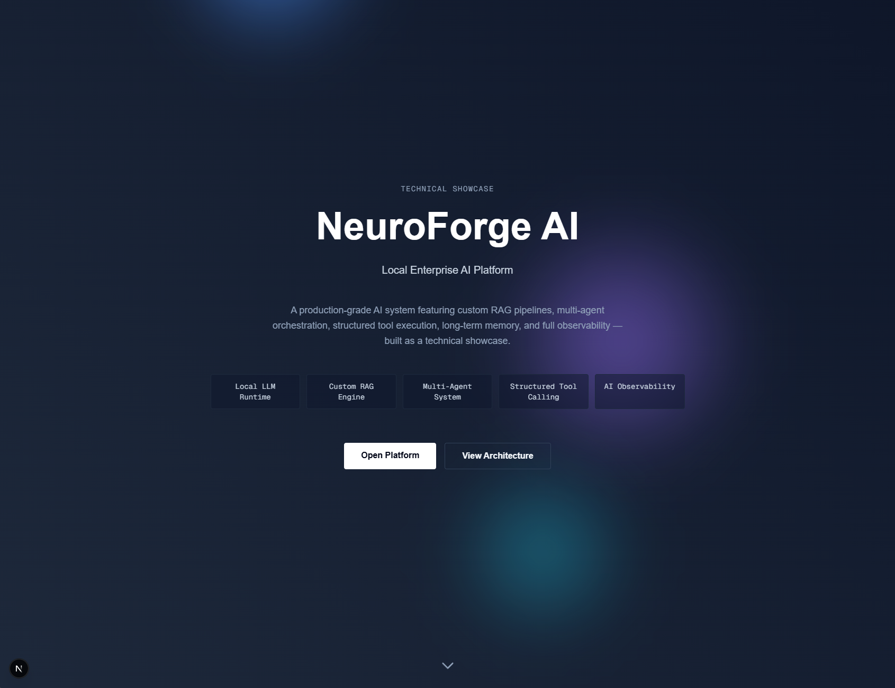
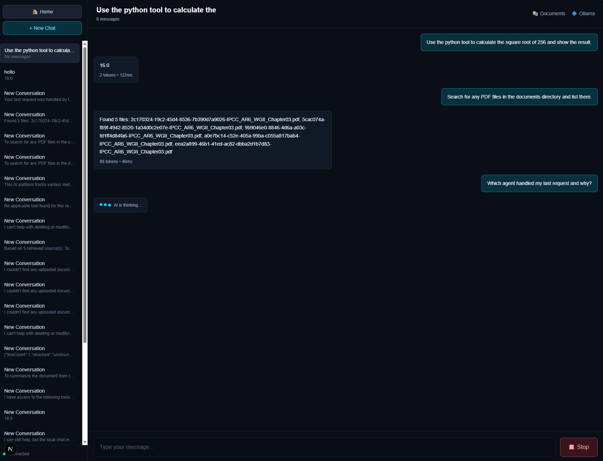
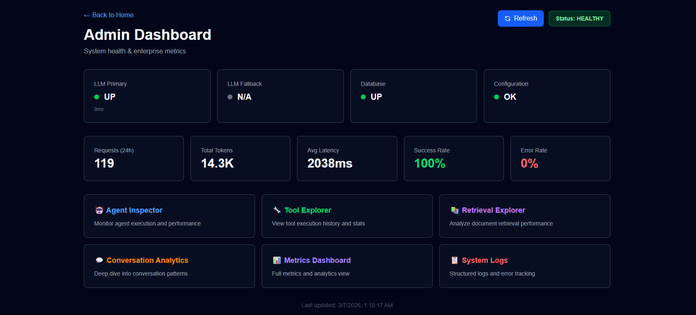
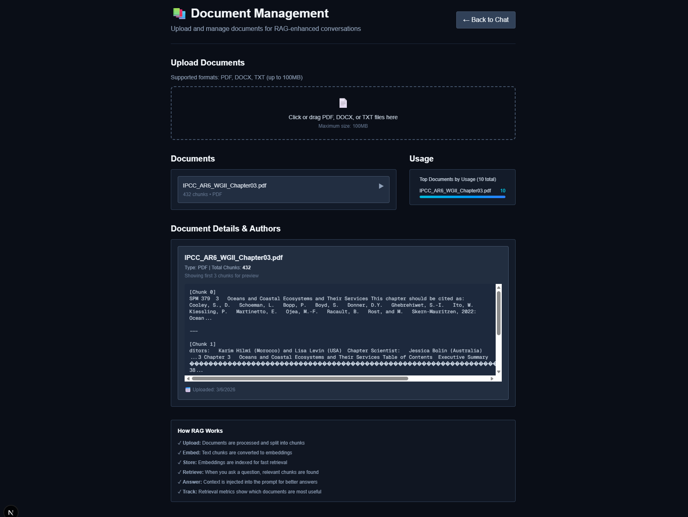
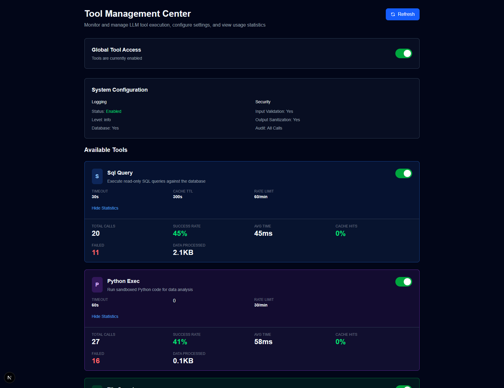
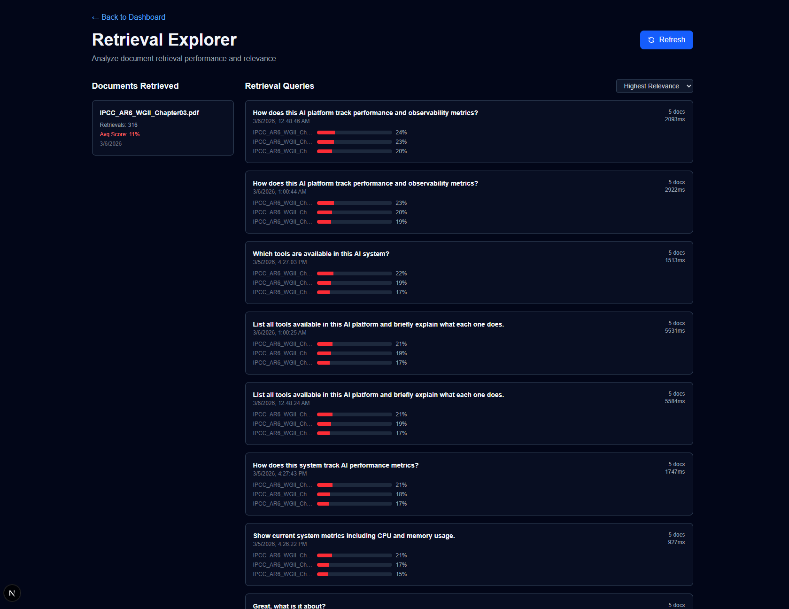

# 🧠 NeuroForge AI

> **Enterprise-grade AI platform featuring multi-agent orchestration, RAG-powered retrieval, and autonomous tool execution—built for local deployment with complete privacy.**

NeuroForge AI is a production-ready conversational AI system that combines advanced agent orchestration, vector-based document retrieval, and dynamic tool execution. Running entirely on local infrastructure, it demonstrates enterprise-level architecture patterns while maintaining full data privacy.


_Landing page showcasing system capabilities and architecture_

---

## 🎯 Key Features

### 🤖 Multi-Agent Orchestration

- **Intent Classification** - Automatically routes queries to specialized agents (Planning, Research, Execution, Evaluation)
- **Planner Agent** - Breaks complex tasks into actionable steps
- **Research Agent** - Performs RAG-based retrieval with adaptive similarity thresholds (0.12-0.3)
- **Tool Agent** - Executes Python code, SQL queries, file searches, and system metrics collection
- **Critic Agent** - Validates outputs and ensures quality before delivery

### 📚 RAG (Retrieval Augmented Generation)

- **Vector Embeddings** - nomic-embed-text model with PostgreSQL pgvector support
- **Adaptive Retrieval** - Context-aware similarity thresholds for precision vs. recall optimization
- **Document Processing** - Automated chunking, embedding, and indexing pipeline
- **Source Citation** - All responses include grounded document references

### 🛠️ Dynamic Tool Execution

- **Python Executor** - Sandboxed code execution with natural language → code conversion
- **SQL Query Engine** - Safe database queries with destructive operation blocking
- **File Search** - Semantic file discovery across uploads directory
- **System Metrics** - Real-time CPU, memory, disk, and network monitoring

### 💬 Persistent Chat System

- **Conversation History** - SQLite-backed persistence survives server restarts
- **Auto-Titling** - Generates meaningful titles from first user message
- **Real-Time Streaming** - Token-by-token response delivery via Server-Sent Events
- **Multi-User Support** - Isolated conversation spaces per user

### 📊 Admin Dashboard

- **Real-Time Metrics** - Live monitoring of agent performance, tool usage, and retrieval quality
- **Conversation Analytics** - Track user engagement, message volume, and response times
- **Document Management** - Upload, embed, and manage knowledge base documents
- **Tool Logs** - Detailed execution history for debugging and auditing


_Real-time chat with persistent conversation history and streaming responses_


_Comprehensive metrics and analytics for system monitoring_

---

## 🏗️ Technical Architecture

### **Frontend**

- **Next.js 14** (App Router, React Server Components)
- **TypeScript** (Strict mode)
- **Tailwind CSS** (Responsive design)
- **React Hooks** (State management)

### **Backend**

- **Node.js** (Runtime)
- **Ollama** (Local LLM inference - mistral:latest)
- **Python 3.x** (Tool execution environment)
- **Prisma ORM** (Database layer)

### **Database & Storage**

- **SQLite** (Conversations, messages, users)
- **PostgreSQL** (Vector embeddings via pgvector)
- **File System** (Document uploads)

### **AI/ML Stack**

- **LLM**: Mistral 7B (via Ollama)
- **Embeddings**: nomic-embed-text
- **Vector Search**: Cosine similarity with adaptive thresholding


_Upload and manage documents for RAG-powered retrieval_

---

## 🚀 Getting Started

### Prerequisites

Ensure you have the following installed:

| Program     | Version | Purpose             | Download Link                    |
| ----------- | ------- | ------------------- | -------------------------------- |
| **Node.js** | 18.x+   | Runtime environment | [nodejs.org](https://nodejs.org) |
| **Python**  | 3.8+    | Tool execution      | [python.org](https://python.org) |
| **Ollama**  | Latest  | Local LLM inference | [ollama.ai](https://ollama.ai)   |

### Installation

1. **Clone the repository**

   ```bash
   git clone https://github.com/yourusername/neuroforge_ai.git
   cd neuroforge_ai
   ```

2. **Install dependencies**

   ```bash
   npm install
   ```

3. **Set up Ollama models**

   ```bash
   ollama pull mistral:latest
   ollama pull nomic-embed-text
   ```

4. **Initialize database**

   ```bash
   npx prisma generate
   npx prisma db push
   ```

5. **Start the development server**

   ```bash
   npm run dev
   ```

6. **Open your browser**
   - Navigate to [http://localhost:3000](http://localhost:3000)

### Services & Ports

| Service     | Port  | Status Endpoint        |
| ----------- | ----- | ---------------------- |
| **Next.js** | 3000  | http://localhost:3000  |
| **Ollama**  | 11434 | http://localhost:11434 |

---

## 🎮 Usage Examples

### 💬 Chat with RAG

```
User: "Summarize the uploaded PDF about machine learning"
→ Retrieves relevant document chunks
→ Generates grounded summary with citations
```

### 🐍 Python Code Execution

```
User: "Use python_exec to calculate sqrt of 144"
→ Converts to: import math; _output.set(math.sqrt(144))
→ Returns: 12
```

### 🗄️ Database Queries

```
User: "How many conversations are in the database?"
→ Executes: SELECT COUNT(*) FROM Conversation
→ Returns count with safety checks
```

### 📁 File Search

```
User: "Search for PDF files in the uploads directory"
→ Scans uploads/ folder
→ Returns list of matching files
```


_Monitor and configure tool execution settings_

---

## 📂 Project Structure

```
neuroforge_ai/
├── app/                    # Next.js App Router pages
│   ├── api/               # API routes (chat, documents, tools)
│   ├── chat/              # Chat interface
│   ├── admin/             # Admin dashboard
│   └── components/        # React components
├── lib/
│   ├── agents/            # Multi-agent orchestration system
│   ├── rag/               # RAG retrieval pipeline
│   ├── tools/             # Tool execution framework
│   ├── llm/               # LLM integration (Ollama)
│   └── db/                # Database services (Prisma)
├── prisma/
│   └── schema.prisma      # Database schema
└── public/uploads/        # Document storage
```

---

## 🔐 Security Features

- ✅ **Destructive Query Blocking** - Prevents DELETE/DROP/TRUNCATE operations
- ✅ **User Isolation** - Conversation-level access control
- ✅ **Sandboxed Execution** - Python code runs in controlled environment
- ✅ **Input Sanitization** - SQL injection prevention
- ✅ **Local-First** - No data leaves your infrastructure


_Track RAG performance with detailed similarity scores and source citations_

---

## 📈 Performance Highlights

- **Streaming Responses** - Sub-second first token latency
- **Adaptive Retrieval** - 0.12 threshold for summaries, 0.3 for queries
- **Connection Pooling** - Optimized database access
- **Caching** - Vector embeddings cached to reduce compute
- **Concurrent Tool Execution** - Parallel processing when possible

---

## 🧪 Testing Features

Test the system capabilities:

1. **RAG Retrieval** - Upload a document, ask questions about it
2. **Tool Execution** - Request Python calculations or SQL queries
3. **Intent Routing** - Ask complex questions requiring multi-step planning
4. **Conversation Persistence** - Refresh page to verify history retention
5. **Admin Metrics** - Monitor system performance in real-time

---

## 🛠️ Development Commands

```bash
# Start development server
npm run dev

# Build for production
npm run build

# Start production server
npm start

# Run type checking
npm run type-check

# Update database schema
npx prisma db push

# View database in Prisma Studio
npx prisma studio
```

---

## 🎓 Key Technical Achievements

✨ **Agent Orchestration** - Sophisticated intent classification routes queries to specialized agents  
✨ **Adaptive RAG** - Context-aware similarity thresholds optimize retrieval quality  
✨ **Natural Language Tools** - Converts plain English to executable code/queries  
✨ **Zero Data Loss** - Full conversation persistence with auto-recovery  
✨ **Real-Time Streaming** - Token-by-token response generation  
✨ **Production Patterns** - Service layer, error handling, logging, metrics

---

## 📝 License

This project is private and proprietary.

---

## 👤 Contact

For inquiries, please reach out via [your contact method].

---

**Built with** ❤️ **using Next.js, TypeScript, Ollama, and Prisma**
